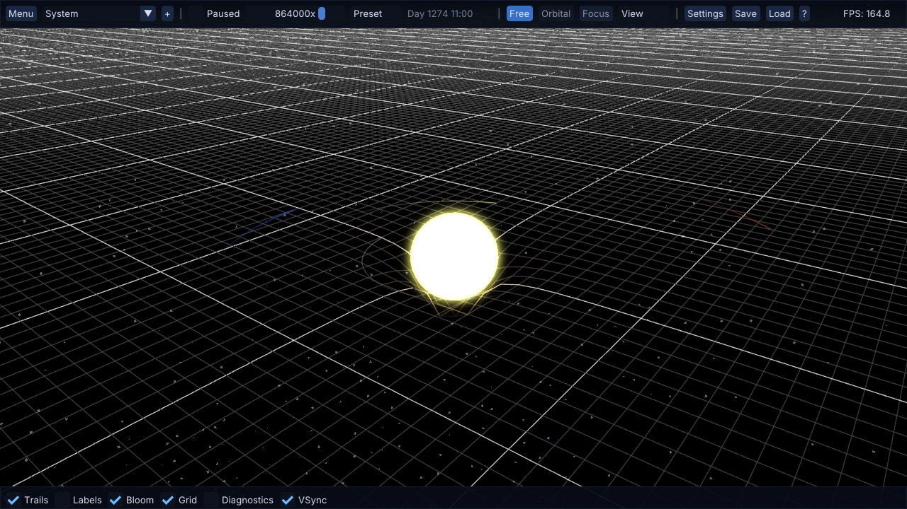
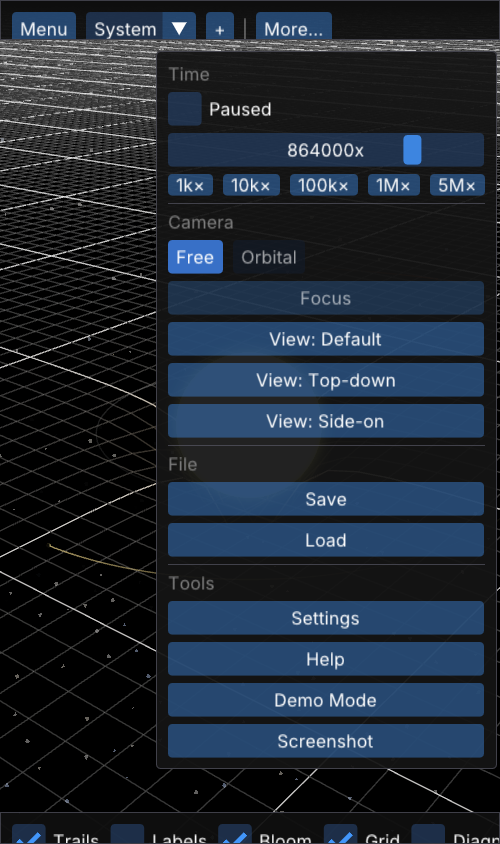

# SolarSystemGL

A real-time 3D Newtonian N-body solar-system simulator — runs natively (OpenGL 3.3) **and in the browser** (WebGL2 / WebAssembly).

    

**▶ Live demo:** **https://solar-system-gl.vercel.app**
**📖 API docs:** [Doxygen reference](https://solar-system-gl.vercel.app/docs) (served at `/docs` on the live site)



> Tip: use `docs/assets/hero.png` as the repo's **social preview** image (Settings → Social preview).

## What it does

- **Newtonian N-body gravity** in double precision (Velocity Verlet, fixed-timestep accumulator), rendered in single precision via a `1 WU = 10⁹ m` unit conversion.
- **Nine-body solar system** out of the box (Sun + 8 planets) with real masses, distances, and orbital velocities — plus bundled presets (asteroid belt, binary stars, TRAPPIST-1, blank slate).
- **Interactive editing**: click a body to inspect/edit mass, density, position, velocity; add bodies on the fly (drag-to-place or a form) and watch orbits respond from the next physics step.
- **Visualisation**: spacetime-curvature grid, orbit trails, path prediction, Lagrange points, procedural rings & atmospheres, emissive bloom, MSAA, procedural starfield.
- **Save / load** simulations to a human-readable text format. On the web build, saves **persist in the browser** (IndexedDB via IDBFS) and can be **exported / imported** as files.
- **Runs on phones**: touch gestures (drag to orbit, pinch to zoom), a responsive UI that reflows into a `More…` overflow menu on small screens, and a quality toggle (MSAA) for weaker GPUs.
- **Screenshots**: `F12` saves a BMP (downloaded in the browser, written to `screenshots/` natively).

<p align="center"></p>

## Try it

The fastest way to play is the **live demo** link above — no install. To run locally, build either target below.

## Build — desktop (Windows / MSVC 2022)

```bash
cmake -S . -B build
cmake --build build --config Release
build\Release\SolarSystemGL.exe
```

Requirements: Visual Studio 2022 (links a vendored `glfw3.lib` built for VC2022), CMake ≥ 3.16, a GPU with OpenGL 3.3. Linux/macOS use the `find_package(glfw3)` fallback path (see [`docs/build.md`](docs/build.md)).

## Build — web (WebAssembly)

Needs the Emscripten SDK + Ninja. See [`BUILDING-WEB.md`](BUILDING-WEB.md) for setup.

```bash
emcmake cmake -S . -B build-web -G Ninja -DCMAKE_BUILD_TYPE=Release
cmake --build build-web
python -m http.server -d build-web 8080   # then open http://localhost:8080/SolarSystemGL.html
```

## Controls

| Input | Action |
|---|---|
| `W` `A` `S` `D` | Move (free camera) |
| Right-click + drag · **one-finger drag** | Look around / orbit |
| Scroll wheel · **two-finger pinch** | Zoom (orbital) / change speed (free) |
| Left-click / tap a body | Smooth-focus / set orbital target |
| `Space` `R` `F` `1` `2` `F1`–`F3` `F5`–`F8` `F11` `F12` | Pause · reset · focus · camera modes · view presets · bookmarks · demo · screenshot |
| Top action bar | System picker, time scale, camera, save/load, settings (overflow `⋯` on mobile) |

## Project layout

```
src/
├── core/      Application, Camera, Window, Shader, Grid, Framebuffer,
│              Screenshot, SaveLoad, WebPersistence (IDBFS), Platform
├── objects/   CelestialBody (physics + identity), PlanetMesh (GL state)
├── physics/   PhysicsSystem (integrator), PathPredictor, Lagrange
├── ui/        UIManager, Actionbar, modals, Toast, Tutorial, UI (responsive helpers)
└── main.cpp   Entry point

shaders/        GLSL sources (embedded at build time; rewritten to ES 3.00 on web)
web/            Emscripten HTML shell
third_party/    glad, GLFW, glm, ImGui (vendored)
docs/           Architecture, build, physics, render, user guide, API refs, ADRs
```

## Documentation

- Hand-written guides: [`docs/`](docs/) — architecture, physics, rendering, user guide, ADRs.
- Generated API reference: [Doxygen](https://solar-system-gl.vercel.app/docs), served at `/docs` on the live site (`doxygen Doxyfile` locally).

## License

MIT — see [`LICENSE`](LICENSE). Contributions welcome: [`CONTRIBUTING.md`](CONTRIBUTING.md).
